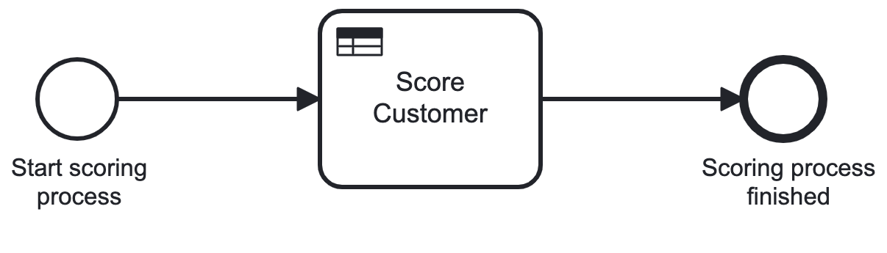
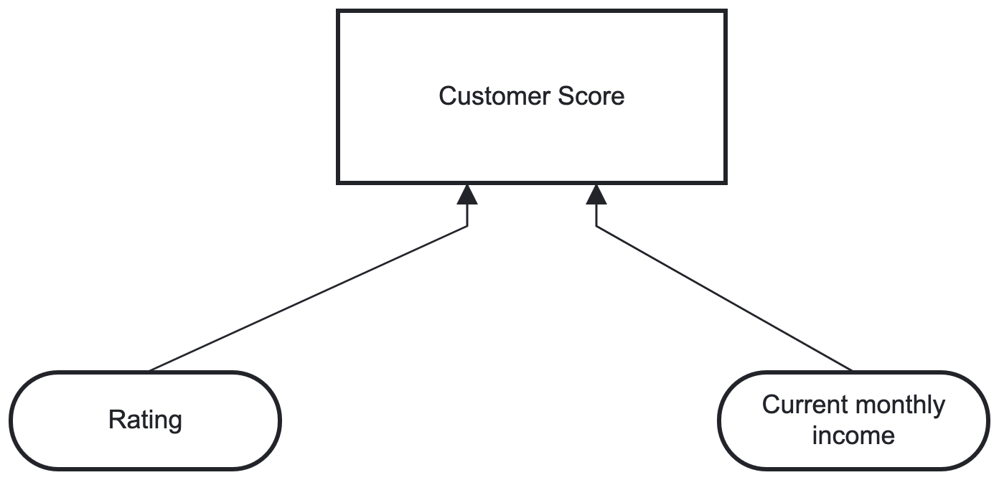
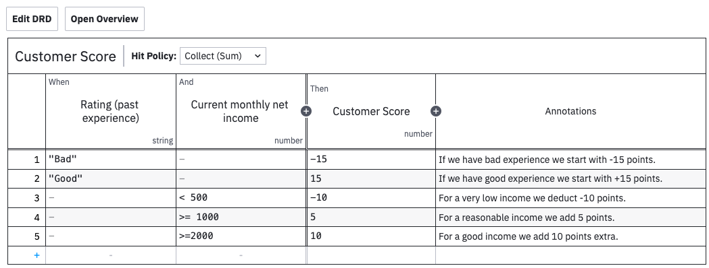
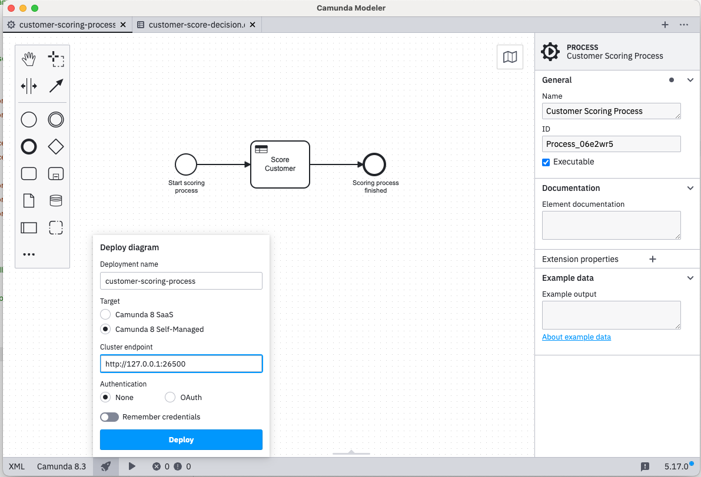

# Customer Scoring - synchronous workflow

Within this demo we're going to see once again how Dapr and Camunda works well together and language agnostic.
In this case with focus on synchronous workflow processing.

---

Workflow handles a request to score customer according to his/her history and current monthly income. 
The scoring result could be used later for pricing and is done synchronously. This is useful in API calls and helps
to break dependencies in code.



---

DMN handles decision and calculates score...



---

with decision table using Collect (sum) policy as described on https://docs.camunda.io/docs/components/best-practices/modeling/choosing-the-dmn-hit-policy/



---

## Dapr

To test locally install Dapr as described on https://docs.dapr.io/getting-started/install-dapr-selfhost/. To run in Docker, no install is needed.

## Camunda

The process will be orchestrated by Camunda - in our case it's Camunda Platform 8. 

`docker compose --env-file .env -f docker-compose-camunda.yaml up -d`

Navigate to http://localhost:8081/login and use demo/demo for login.

Now deploy the process. One way how to do it is from Camunda Modeler. 
It can be downloaded from https://camunda.com/download/modeler/.



## Run 

Local: `dapr run --app-id scoring-api --app-port 6029 --resources-path ../dapr/components -- dotnet run --urls http://localhost:5029`

Docker: `docker compose -f docker-compose.yaml up -d --build`

Open ScoringAPI.http and run requests.

## Logs

See logs in Zipkin: http://localhost:9411 (with local Dapr install) or http://localhost:9414 (Docker).

## Clean up

```terminal
docker compose -f docker-compose.yaml down
docker compose -f docker-compose-camunda.yaml down -v
```

## Notes

Running app in Docker requires changing localhost to host.docker.internal and is applicable to to Zeebe gateway and Zipkin.

