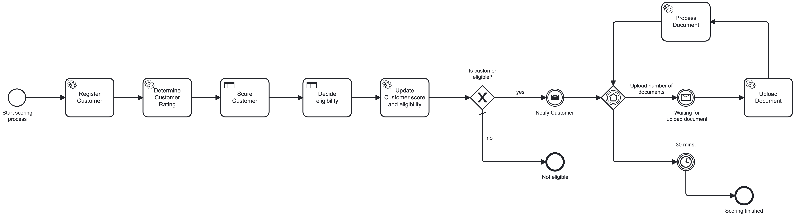
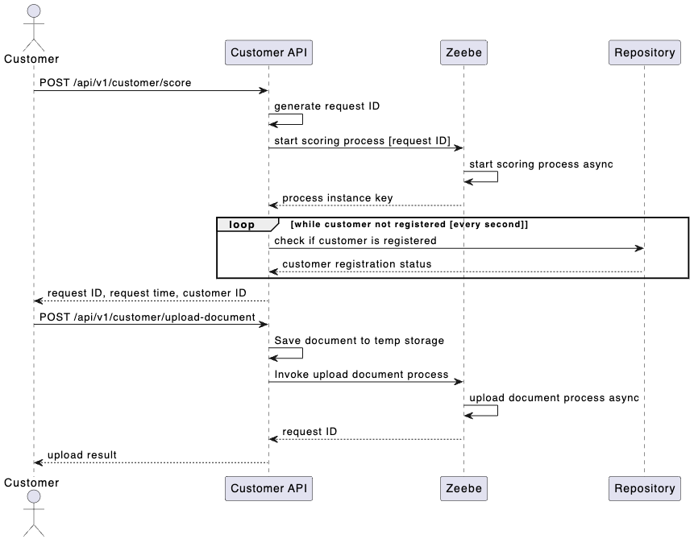

# Customer Scoring

This demo further extends the previous one where all the logic is done within one synchronous flow. Nothing wrong with this approach, but when it comes real world scenarios, life is almost never that easy. So last time it was just a simple Score process, implemented within DMN task.

## Old process (simple synchronous flow)


## Advantages of Synchronous Flows

1. Simplicity: Synchronous flows are easier to understand and implement because the sequence of operations is straightforward. Each step waits for the previous one to complete before proceeding.

2. Immediate Feedback: Since each step waits for the previous one to complete, you get immediate feedback on the success or failure of each operation. This can simplify error handling and debugging.

3. Easier to Test: Testing synchronous flows can be simpler because the sequence of operations is predictable and easier to control.

## Disadvantages of Synchronous Flows

1. Resource Blocking: In a synchronous flow, resources (e.g., threads, connections) are held until the operation completes. This can lead to resource exhaustion, especially in systems with many concurrent operations.

2. Reduced Fault Tolerance: If any step in a synchronous flow fails, the entire process can be halted. This can make the system less resilient to failures.

3. Limited Flexibility: Synchronous flows are less flexible in handling long-running operations or tasks that can be performed in parallel. This can limit the ability to optimize performance and resource utilization.

## The NEW business requirement

Now lets have a business case where customer wants to apply for incredible product giving him lots of incredible advantages from out incredible company. To evaluate customer eligibility we need to:

1. score the customer (customer eligibility) - synchronous 
2. if the score is good enough, customer uploads necessary documents - asynchronous, expects multiple calls.

Result of the first process is entry point to the other.
 
### Solution 1: Process split

Each process can run either synchronous or asynchronous, but can't mix. Having 2 separate processes is an option, but lacks cross processes visibility.

### Solution 2: One process

Since the second is asynchronous, the first process (part of the process) must be asynchronous too.



There is only 1 process for the whole business case. It could be split into multiple small processes, but I want to keep links about parent-child. 
Also, I want to be able to tell how many requests were done by the customer and what was the customer score.

Solution is to keep state of customer (or customer request) independent of the process flow. Request ID is the correlation key between the two processes.
 
## Sequence Diagram

The following sequence diagram shows the basic flow of the scoring process:



When customer requests scoring:
1. API generates unique request ID
2. API starts scoring process via Dapr client
3. API polls repository until customer is registered
4. API returns request details to customer

When customer uploads document:
1. API saves document to temporary storage
2. API invokes document upload process via Dapr client
3. API returns upload result to customer


---

### Scoring Table

| Rating       | Monthly Income Range | Scoring Number |
|--------------|----------------------|----------------|
| Bad          | 0 - 999              | 20             |
| Bad          | 1000 - 1999          | 25             |
| Bad          | 2000 - 2999          | 30             |
| Bad          | 3000 - 3999          | 35             |
| Bad          | >= 4000              | 40             |
| Neutral      | 0 - 999              | 50             |
| Neutral      | 1000 - 1999          | 55             |
| Neutral      | 2000 - 2999          | 60             |
| Neutral      | 3000 - 3999          | 65             |
| Neutral      | >= 4000              | 70             |
| Good         | 0 - 999              | 80             |
| Good         | 1000 - 1999          | 85             |
| Good         | 2000 - 2999          | 90             |
| Good         | 3000 - 3999          | 95             |
| Good         | >= 4000              | 100            |
| -            | -                    | 0              |

Then based on the score decide customer eligibility.

### Customer Eligibility Table

| Score Range | Eligibility  |
|-------------|--------------|
| < 60        | Not Eligible |
| >= 60       | Eligible     |

We could merge both DMN into one too.

---

with decision table using Collect (sum) policy as described on https://docs.camunda.io/docs/components/best-practices/modeling/choosing-the-dmn-hit-policy/

## Final thoughts

It always depends on business requirements. Having 2 independent processed may still be a valid choice. In this scenario, the business requirement is to see all the whole follow-ups so that we can track activity. Important is not to mix responsibilities. Each layer is independent.

**API layer** - expose interface to some 3rd party system (ouside of scope for this demo). It's implemented in CustomerController. There is (almost) no logic and only triggers the process.

**Business layer** - Camunda as process orchestrator, but still must reflect the business case. It's tempting to use Tasks like "Retrieve customer". I don't like it. Instead I can use something like "Determine existing customer", because it reflects business activity. These are commands, not queries. CustomerController expose RPC endpoints (not REST) to Zeebe. 

**Persistence layer** - only a simple Repository pattern. There is a [Customer Model](./ScoringAPI/Models/Customer.cs) to store all the scoring requests in [Customer Repository](./ScoringAPI/Repositories/CustomerRepository.cs) and link uploaded documents. It can be tested independently of all the other layers. 

---

**Possible Improvements:** Here I track all the scoring requests on Customer object. It has some downsides. Even better could be to store Scoring Requests and Customer as independent objects in dedicated state stores. Also, what if the process is already finished and customer uploads another document? 

Long running processes are huge advantage in our scenario.   

## How to run

1. Run infrastructure components (Camunda, MailDev, Mongo, Zipkin) in Docker:

```terminal
docker compose --env-file .env -f docker-compose-infra.yml up -d
```

Navigate to http://localhost:8081/login and use demo/demo for login.

Now deploy the process. One way how to do it is from Camunda Modeler.
It can be downloaded from https://camunda.com/download/modeler/.

2. Build and run the app in Docker: 

```terminal
docker compose -f docker-compose.yml up -d --build
```

3. Open ScoringAPI.http and run requests. 

4. Open http://localhost:4000 to see incoming emails

5. Traces are in Zipkin http://localhost:9414

## Clean up

```terminal
docker compose -f docker-compose.debug.yml down
docker compose -f docker-compose-camunda.yml down -v
```